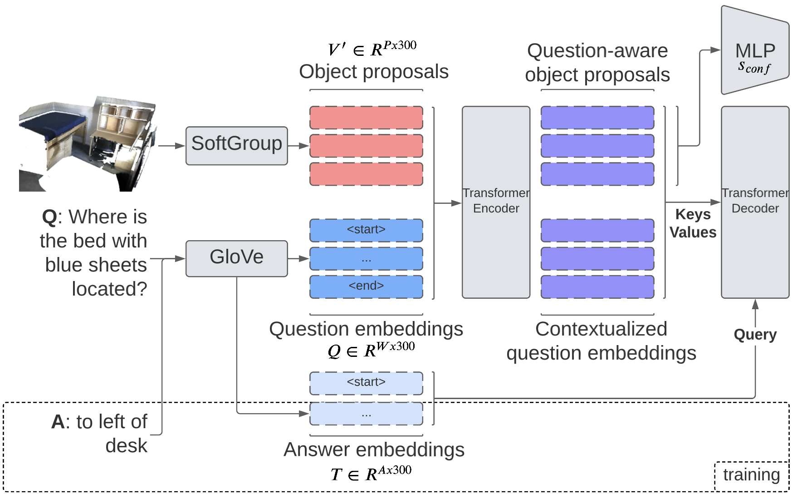

# Generating Context-Aware Natural Answers for Questions in 3D Scenes

<p align="center"></p>

## Abstract

3D question answering is a young field in 3D vision-language that is yet to be ex-
plored. Previous methods are limited to a pre-defined answer space and cannot generate
answers naturally. In this work, we pivot the question answering task to a sequence
generation task to generate free-form natural answers for questions in 3D scenes (Gen3DQA). To
this end, we optimize our model directly on the language rewards to secure the global
sentence semantics. Here, we also adapt a pragmatic language understanding reward
to further improve the sentence quality. Our method sets a new SOTA on the ScanQA
benchmark (CIDEr score 72.22/66.57 on the test sets).

Project page: [Generating Context-Aware Natural Answers for Questions in 3D Scenes](https://proceedings.bmvc2023.org/596/)

By: [Mohammed Munzer Dwedari](https://munzerdwedari.com), [Matthias Nießner](https://www.niessnerlab.org/) and [Dave Zhenyu Chen](https://daveredrum.github.io)

From: [Technical University of Munich](https://www.tum.de/en/)

Find our results on the [ScanQA benchmark](https://eval.ai/web/challenges/challenge-page/1715/overview). 

## Setup

**Environment requirements**
- CUDA 11.X
- Python 3.8

Please refer to the [MINSU3D installation guide](code/minsu3d/README.md). We will update the setup section with the additional conda requirements.

## Dataset

Please refer to [data preparation](docs/dataset.md) for preparing the ScanNet v2 and ScanQA datasets.

## Usage

If you want to use pre-trained models, please download them from the section below.

### Predicting

  - Prediction with the test dataset:

    ```shell
    python predict.py model.vqa.weights=<PATH TO YOUR MODEL WEIGHTS> model.softgroup.weights=<PATH TO YOUR SOFTGROUP MODEL WEIGHTS> data.scanqa.test_w_obj=True (False for w/o object ids)
    ```
    The predictions can be found under `output/<experiment>/predictions`
  
### Scoring

  - Scoring on the validation dataset (will automatically use the predictions in `output/<experiment>/inference`):

    ```shell
    python score.py model.experiment_name=<EXPERIMENT>
    ```
  
  - Scoring on the test datasets:
    Please upload your inference results (predictions_test_w_obj.json or predictions_test_wo_obj.json) to the [ScanQA benchmark](https://eval.ai/web/challenges/challenge-page/1715/overview), which is hosted on [EvalAI](https://eval.ai/).

### Training

In a section below you can find pretrained models.

- #### SoftGroup

    ```shell
    cd code/minsu3d
    ```

  Please refer to [MINSU3D training guide](code/minsu3d/README.md) to train SoftGroup. In the MINSU3D code, we modified the data preparation script and the model to fit the ScanRefer object classes. You can skip the training and use our pretrained SoftGroup model below.

  Once you finish training SoftGroup, move the `code/minsu3d/data/scannet/` folder to `data/`. We already included the precomputed object proposals we used in our training in `data/`. In case you want to re-compute the object proposals, please run the following command:

  ```shell
    python train.py model.precompute_softgroup_data=True data.batch_size=16 model.softgroup.weights=<PATH TO SOFTGROUP WEIGHTS>
  ```
  This will save (in `data/precompute_softgroup_data`) the object proposals, bounding boxes and class scores of the objects in all train and val scenes.

- #### VQA

  ##### XE Loss

    ```shell
    python train.py
    ```

  ##### CIDEr Loss (without VQG)

    ```shell
    python train.py model.activate_cider_loss=True model.optimizer.lr=0.00002 model.vqg.factor=0.0 model.vqa.weights=<PATH TO VQA MODEL TRAINED WITH XE LOSS>
    ```

  ##### CIDEr Loss (with VQG)

    ```shell
    python train.py model.activate_cider_loss=True model.optimizer.lr=0.00002 model.vqa.weights=<PATH TO VQA MODEL TRAINED WITH XE LOSS> model.vqg.weights=<PATH TO VQG WEIGHTS>
    ```

- #### VQG
  If you want to train with the additional VQG reward, you can train train VQG with the following command:

   ```shell
    python train.py model.freeze_vqa=True model.freeze_vqg=False
    ```

### Testing

  - Test a trained model in the validation dataset:

    ```shell
    python test.py model.vqa.weights=<PATH TO YOUR MODEL WEIGHTS>
    ```
    The predictions can be found under `output/<experiment>/inference` 

### Pretrained Models

| Model                                                                                            |Comment   
|--------------------------------------------------------------------------------------------------|---------|
|[SoftGroup](https://drive.google.com/file/d/1MpWNUOTNujwesz5ewNRj7fAe4p2UFsYA/view?usp=drive_link)|Our pretrained SoftGroup model trained with ScanRefer object classes using `code/minsu3d` |
|[VQA_XE](https://drive.google.com/file/d/1HypX_L33UgpHp_Eo4WgKS2OjzajW6fJF/view?usp=sharing)|VQA model trained on XE loss|
|[VQA](https://drive.google.com/file/d/1b_c_IOfpUHZ5Au1BubR44E5XDKXxqgrC/view?usp=sharing)|Final and best model trained with VQA & VQG reward|
|[VQG](https://drive.google.com/file/d/1njlBbAkhVGRwdlFKjWvVk1YkOYTopXwa/view?usp=drive_link)|VQG model used to train final VQA model|

## Visualization

To create visualizations, edit the filter_questions in the ```visualize.py``` file then:
```shell
python visualize.py --split val (or test_w_obj, test_wo_obj)
```
The scenes will be saved to 'output_ply' by default. Run ```python visualize.py --help``` for more options.

## Logging

You can use tensorboard to check losses and accuracies by visiting <b>localhost:6006</b> after running:
```shell
tensorboard --logdir output
```

## Citation

If you found our work helpful, please kindly cite our paper:

```shell
@inproceedings{Dwedari_2023_BMVC,
  author    = {Mohammed Munzer Dwedari and Matthias Niessner and Zhenyu Chen},
  title     = {Generating Context-Aware Natural Answers for Questions in 3D Scenes},
  booktitle = {34th British Machine Vision Conference 2023, {BMVC} 2023, Aberdeen, UK, November 20-24, 2023},
  publisher = {BMVA},
  year      = {2023},
  url       = {https://papers.bmvc2023.org/0596.pdf}
}
```


